Technexion Ubuntu Root Filesystem Creator
===========================

## Overview
--------
Ubuntu rootfs(Root Filesystem) creator is a set of bash scripts, that help the
users to produce a customized ubuntu image using Cananical unique tool named `debootstrap`,
then adapt QEMU to config custom packages and tools on host PC.

## Host PC environment setup
--------
General Packages Installation ( Ubuntu 16.04 or above)

    $ sudo apt-get install apt-get install debootstrap qemu-system-arm qemu-user-static

## Starting create custom rootfs
--------

Create a workspace folder then download Technexion Ubuntu Rootfs Creator:

    $ mkdir ubuntu_rootfs
    $ cd ubuntu_rootfs
    $ git clone https://github.com/TechNexion-customization/ubuntu-tn.git cookers

Source the rootfs creator for your target plaform, Default OS is Ubuntu 18.04 LTS:

    For IMX6 with Ubuntu XFCE Desktop (HW accleration)
    $ source cookers/env.bash.imx6.xfce

    For IMX7 with Ubuntu Terminal
    $ source cookers/env.bash.imx7.terminal

Issue command to generate Technexion fs_overlay, you also can skip this step if you adapt your custom fs_overlay:

    $ merge_tn_fs_overlay

Copy your compiled Linux Kernel moduels to fs_overlay folder (recommended):

    $ sudo cp -rv <target kernel folder>/modules/<specific kernel modules> cookers/fs_overlay/lib/modules/

Copy your custom excutable binary, configuration and libraries: to fs_overlay folder (recommended):

    $ sudo cp -rv <custom binary files> cookers/fs_overlay/usr/bin/
    $ sudo cp -rv <custom libraries files> cookers/fs_overlay/usr/lib/
    $ sudo cp -rv <custom configuration file> cookers/fs_overlay/etc/

Running Creator, need about one hour at the first time:

    $ gen_pure_rootfs
    (output file is a tarball named rootfs.tgz)

    Defualt login username and password are:
    ubuntu:ubuntu

Replace your new Ubuntu rootfs to the target board:

Step 1. Format the partition of rootfs:

    $ sudo mkfs.ext4 /dev/sdx2
    NOTE: x is up to your device node

Step 2. Mount the partition of rootfs:

    $ sudo mount /dev/sdx2 mnt

Step 3. Extracting the Ubuntu rootfs tarball to the partition of rootfs:

    $ cd mnt
    $ sudo tar zxvf ../rootfs.tgz

Step 4. umount the partition and enjoy your Ubuntu OS:

    $ cd ..
    $ sudo umount mnt

Later chapters have detail description about what is the fs_overlay and how to make a highly customized rootfs.

## FS_OVERLAY
--------

fs_overlay is a folder holds custom configuration files, it has
the same folder structure as target rootfs, so if you have some specfic
setting or execute files, please take files to fs_overlay first, Ubuntu creator will copy to the target rootfs.

## How to add new packages at default configuration
--------

Please add new packages in cookers/tn_install.sh script if necessary:
Search "apt-get source update and installation" word and add packages such as

    # apt-get source update and installation
    sudo apt-get update
    yes "Y" | apt install openssh-server iw wpasupplicant hostapd util-linux procps iproute2 haveged dnsmasq iptables net-tools bluez ppp ntp ntpdate bridge-utils
    yes "Y" | apt install bash-completion
    + yes "Y" | apt install <your packages>

Another way is add new packages to apt_list (xfce case is recommended)

## How to change the Ubuntu revision
--------

Some users could be have other Ubuntu revision requirement, please modify gen_pure_rootfs API of cookers/env.bash script as following:

    - sudo debootstrap --arch=armhf --keyring=/usr/share/keyrings/ubuntu-archive-keyring.gpg --verbose --foreign bionic ${TOP}/rootfs
    modify to Ubuntu 16.04 Xenial
    + sudo debootstrap --arch=armhf --keyring=/usr/share/keyrings/ubuntu-archive-keyring.gpg --verbose --foreign xenial ${TOP}/rootfs

NOTE: The users also can change any revision using above method, just replace the release name is enough.

## How to playback video using gst-launch-1.0 on XFCE
--------

Adapt IPU SINK:

    gst-launch-1.0 playbin uri=file:/home/ubuntu/test.webm video-sink="imxipuvideosink"

Adapt G2D SINK:

    gst-launch-1.0 playbin uri=file:/home/ubuntu/test.webm video-sink="imxg2dvideosink"

Adapt EGL X11 window SINK(recommended):

    export DISPLAY=:0.0
    gst-launch-1.0 playbin uri=file:/home/ubuntu/test.webm video-sink="imxeglvivosink"

## How to open a camera previewing using gst-launch-1.0 on XFCE
--------

Adapt IPU SINK:

    gst-launch-1.0 imxv4l2videosrc ! imxipuvideosink

Adapt G2D SINK:

    gst-launch-1.0 imxv4l2videosrc ! imxg2dvideosink

Adapt EGL X11 window SINK:

    export DISPLAY=:0.0
    gst-launch-1.0 imxv4l2videosrc ! imxeglvivsink

## How to test the GPU on XFCE
--------
Support List:

* GLES2
* GLES3
* OPENCL
* OPENVG

OpenGLES3 benchmark testing:

    export DISPLAY=:0.0
    glmark2

## How to enabling the QCA9377 WiFi function on XFCE
--------

Prepare firmware files
This SDK is supporting Qualcomm(QCA) WLAN module - QCA9377 as default configuration, Because of the license restriction, please contact TechNexion FAE or Sales to get licensed firmware files, default

    Contact Window: sales@technexion.com

After getting the firmware binary: .. Decompress the tarball and put all the firmware files into

    cp -rv QCA9377/* <source folder>/rootfs/lib/firmware/

Then repackage the rootfs as a tarball again, WiFi function will be working! Enjoy!

1. WiFi Station Mode

Clicking the network manager icon of right top side.
Note that please select the hotspot under "Wi-Fi Networks (wlan0)", NOT "Wi-Fi Networks (p2p0)", or you will got a connection failed message.
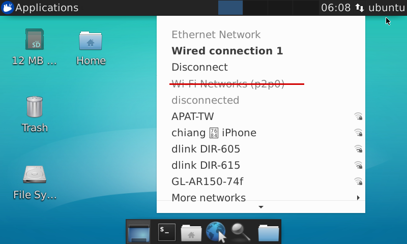
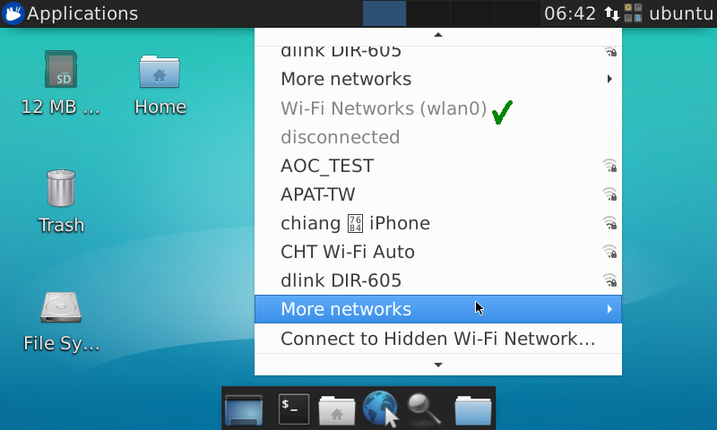

Then enter the password for your target hotspot, note that the "Wi-Fi adapter" need choose wlan0, it works after click "Connect" button.
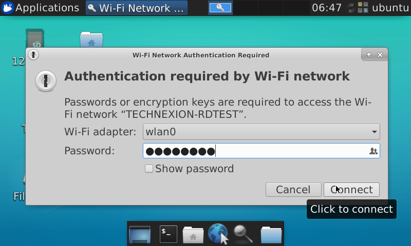
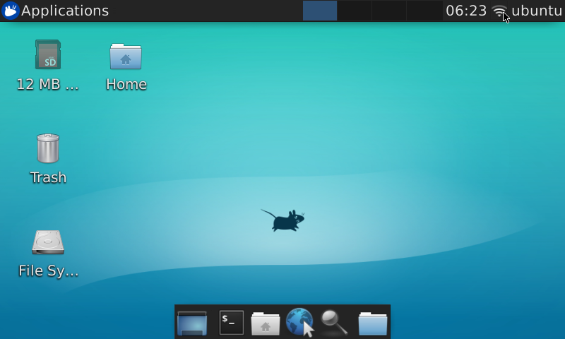

2. WiFi AP Mode

Please choose the "Edit Connections" item first.
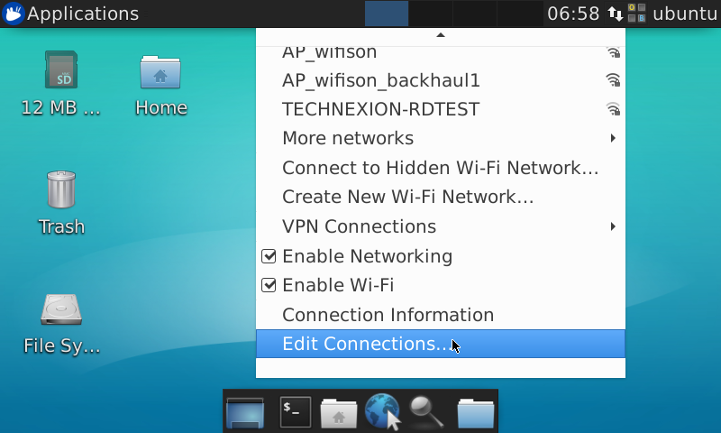

Choose the "Wi-Fi" as your connection type.
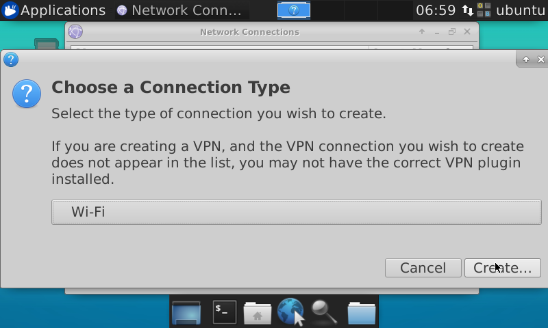

Setting the relative configuration as following picture, remember to set "Hostpot" as default mode.
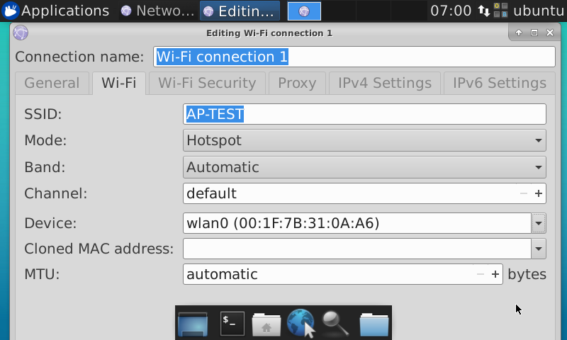

Setting the WPA password(recommended), then save the configuration and exit, and reboot the Ubuntu.
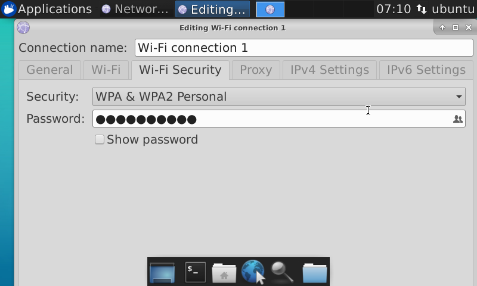

Note that some resolution of screen may not show the save item(too small), please click the WPA password text once, and plug-in a USB keyboard, then press "TAB" key two times and press "Enter" key to save it directly.

After reboot, the hotspot already works! the user can connect it via smart phone, notebook or other devices.
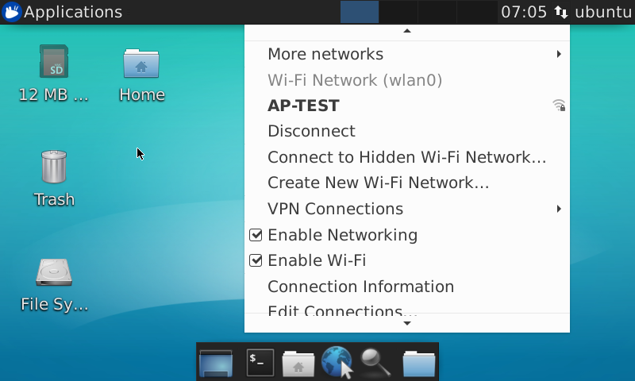

## How to expand the system partition to full eMMC size
--------

Please issue commands After boot up (both okay using debug console or in XFCE terminal):

    ubuntu@technexion:~/mnt/test_video$ sudo fdisk /dev/mmcblk2

    Welcome to fdisk (util-linux 2.31.1).
    Changes will remain in memory only, until you decide to write them.
    Be careful before using the write command.

    Command (m for help): p
    Disk /dev/mmcblk2: 14.6 GiB, 15678308352 bytes, 30621696 sectors
    Units: sectors of 1 * 512 = 512 bytes
    Sector size (logical/physical): 512 bytes / 512 bytes
    I/O size (minimum/optimal): 512 bytes / 512 bytes
    Disklabel type: dos
    Disk identifier: 0x567639dc

    Device         Boot Start     End Sectors  Size Id Type
    /dev/mmcblk2p1       8192   49151   40960   20M  c W95 FAT32 (LBA)
    /dev/mmcblk2p2      49152 5169151 5120000  2.5G 83 Linux

Remember the start sector in partition 2, then delete partition 2 as following parameters:

    Command (m for help): d
    Partition number (1,2, default 2): 2

    Partition 2 has been deleted.

Create partition 2 again, and input the correct start sectors, note that the end sector just press 'enter' key, then press 'w' to save the new configuration:

    Command (m for help): n
    Partition type
        p   primary (1 primary, 0 extended, 3 free)
        e   extended (container for logical partitions)
    Select (default p):

    Using default response p.
    Partition number (2-4, default 2):
    First sector (2048-30621695, default 2048): 49152
    Last sector, +sectors or +size{K,M,G,T,P} (49152-30621695, default 30621695):

    Created a new partition 2 of type 'Linux' and of size 14.6 GiB.
    Partition #2 contains a ext4 signature.

    Do you want to remove the signature? [Y]es/[N]o: Y

    The signature will be removed by a write command.

    Command (m for help): p
    Disk /dev/mmcblk2: 14.6 GiB, 15678308352 bytes, 30621696 sectors
    Units: sectors of 1 * 512 = 512 bytes
    Sector size (logical/physical): 512 bytes / 512 bytes
    I/O size (minimum/optimal): 512 bytes / 512 bytes
    Disklabel type: dos
    Disk identifier: 0x567639dc

    Device         Boot Start      End  Sectors  Size Id Type
    /dev/mmcblk2p1       8192    49151    40960   20M  c W95 FAT32 (LBA)
    /dev/mmcblk2p2      49152 30621695 30572544 14.6G 83 Linux

    Filesystem/RAID signature on partition 2 will be wiped.

    Command (m for help): w
    The partition table has been altered.
    Syncing disks.

It works, please reboot the system and check the partition 2 size, it should be chagned.

## How to enabling the 3G/4G mobile communication function on XFCE Network-Manager
--------

Prepare a CDMA type or LTE type modules, and click onto our mini PCIE or M.2 connector of baseboard.

Then following the steps as below pictures, very easy way!

Example:

Country: Taiwan
SIM card Provider: Chunghwa Telecom
Note that disable PIN password as default configuration is recommended.

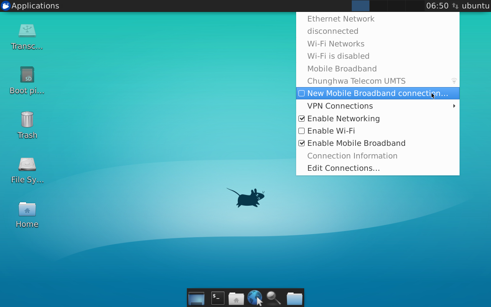
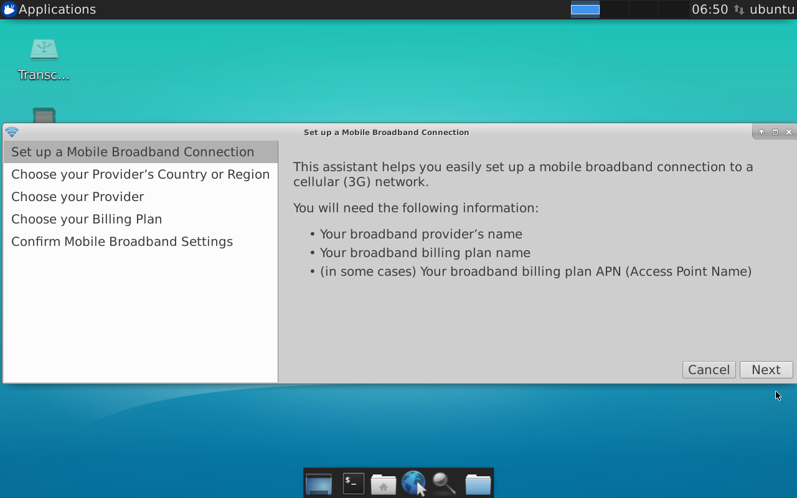
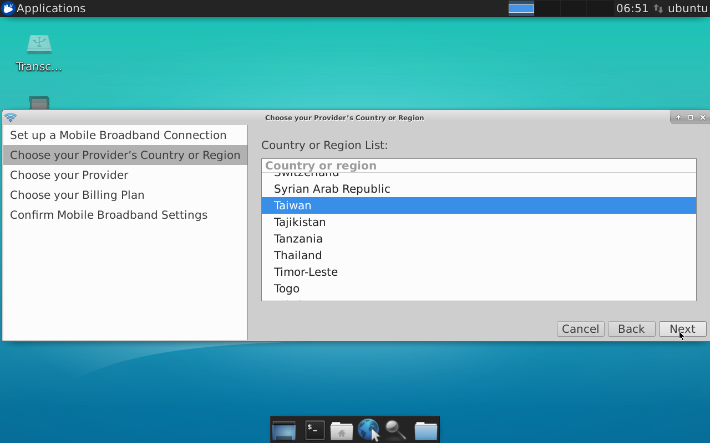
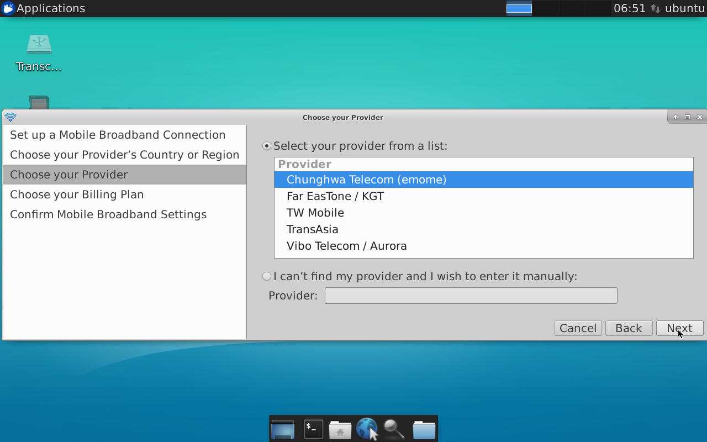
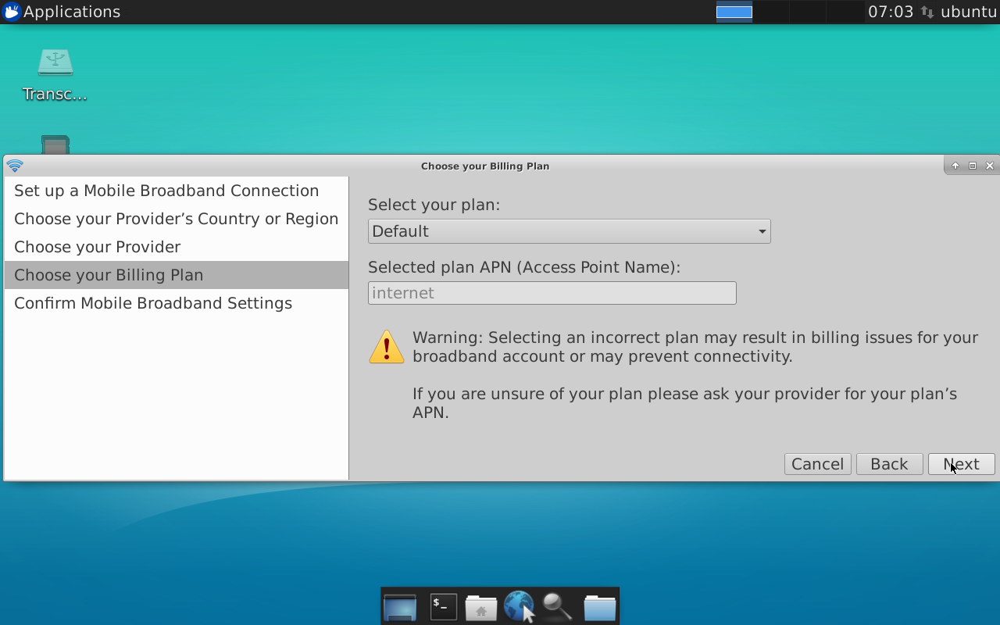
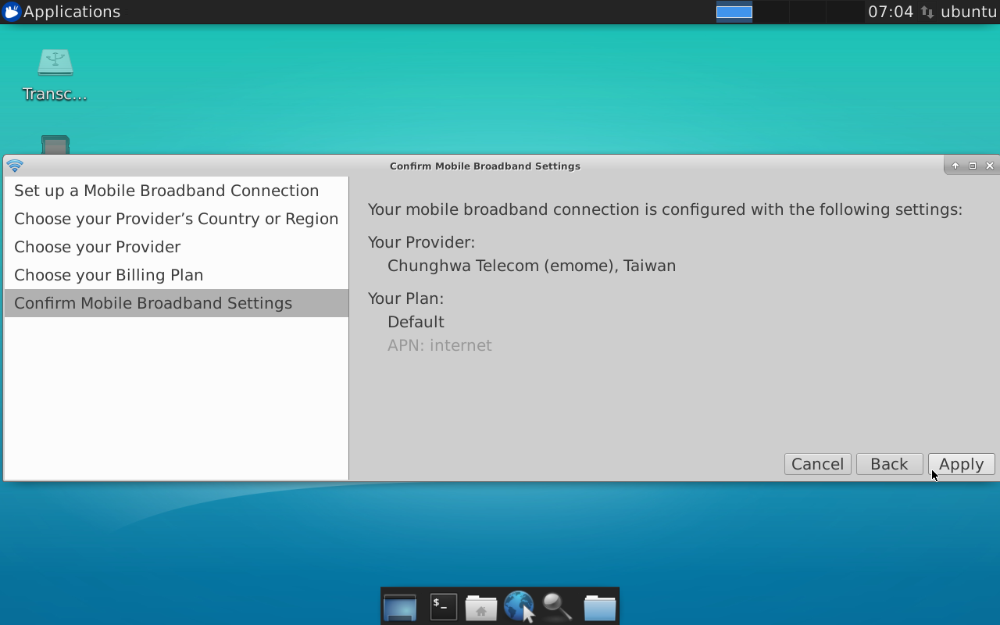
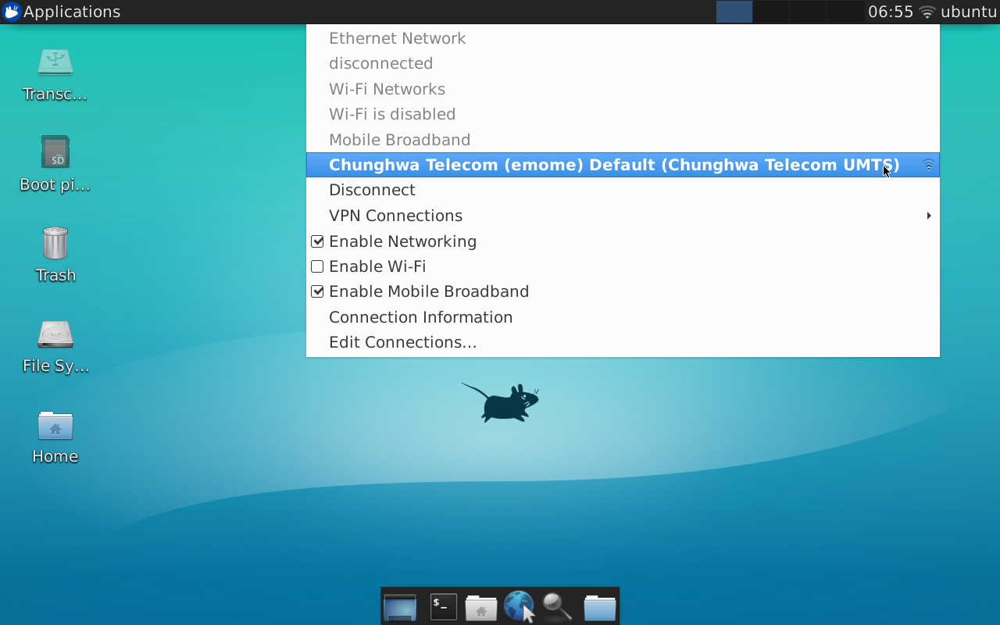
